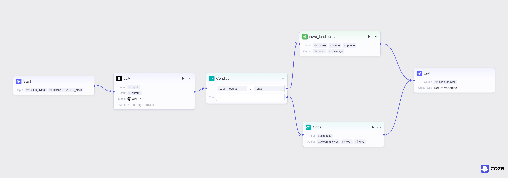
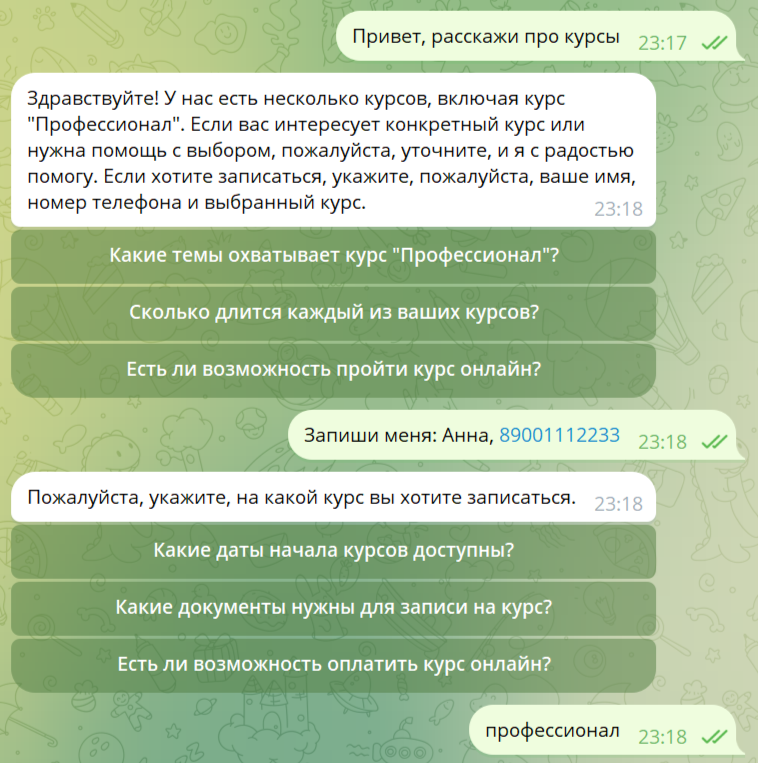
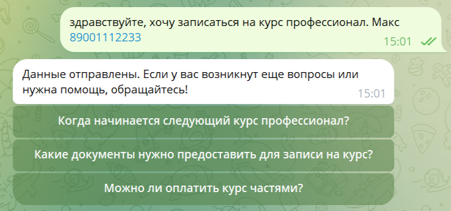
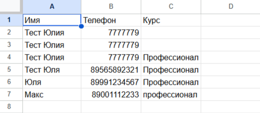

# AI-агент для автоматизации лидогенерации (Coze + Telegram)

Проект интеллектуального ассистента, который квалифицирует запросы пользователей и автоматически сохраняет контактные данные в CRM-систему (Google Sheets).

## Архитектура системы

<figure>
  
  <figcaption><i>Рис 1. Схема движения данных: Telegram -> Coze Workflow -> Google Sheets.</i></figcaption>
</figure>

## Функционал
- **Распознавание намерений (Intent Recognition):** Автоматическое разделение входящих запросов на консультационные и транзакционные.
- **Обработка данных (Data Cleaning):** Использование Python-скрипта для очистки технических метаданных LLM.
- **Интеграция:** Бесшовная связка мессенджера с таблицами учета.

## Техническая реализация очистки данных
Для удаления технических JSON-тегов из ответа нейросети используется Python-скрипт в блоке Code:

```python
import re
# Скрипт находит паттерны {intent: ...} и удаляет их из текста
clean_text = re.sub(r'\{.*\}', '', llm_text).strip()
```
## Верификация работы (End-to-End Test)

### 1. Тестирование диалоговой логики в Telegram

**Сценарий А: Уточнение недостающих данных**

<figure>
  
  <figcaption><i>Рис 2. Бот удерживает контекст и запрашивает телефон, если он не был указан.</i></figcaption>
</figure>

<br>
<br>

**Сценарий Б: Мгновенная регистрация**

<figure>
  
  <figcaption><i>Рис 3. Успешная обработка заявки при наличии полной информации.</i></figcaption>
</figure>

<br>
<br>

### 2. Результат в Google Sheets

Данные из обоих сценариев успешно зафиксированы в итоговой таблице:

<br>

<figure>
  
  <figcaption><i>Рис 4. Автоматическая запись лидов в CRM-таблицу.</i></figcaption>
</figure>
